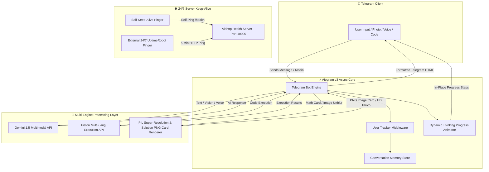

<div align="center">

# 🤖 Telegram AI Assistant Bot (24/7 Omnimodal AI)

<p align="center">
  <a href="https://github.com/Kosalsensok/telegram-python-bot">
    
  </a>
</p>

[](https://www.python.org/)
[](https://docs.aiogram.dev/)
[](https://ai.google.dev/)
[](https://render.com/)
[](https://uptimerobot.com/)
[](LICENSE)

---

### 🌐 Multilingual Overview / សេចក្តីសង្ខេបភាសា

**English:** A state-of-the-art, production-grade 24/7 Omnimodal Telegram AI Bot powered by Gemini 1.5 Multimodal Engine. Features real-time conversational memory, Khmer & Standard LaTeX Math Solver, PNG Solution Card Rendering, AI Image Unblur & Super-Resolution, Piston Sandboxed Code Execution Engine, Voice Note Transcription, PDF OCR Document Analysis, and Dynamic In-Place Animated Progress Indicators.

**ភាសាខ្មែរ (Khmer):** ជំនួយការ AI Bot ឆ្លាតវៃដំណើរការ 24/7 លើ Telegram ជាមួយបច្ចេកវិទ្យាចុងក្រោយ Gemini 1.5។ មានសមត្ថភាពខ្ពស់ក្នុងការឆ្លើយសំណួរទូទៅ, ដោះស្រាយលំហាត់គណិតវិទ្យា/វិទ្យាសាស្ត្រ (បង្កើតជារូបភាព PNG Card ចម្លើយច្បាស់ត្រជាក់ភ្នែក), កែរូបភាពមិនច្បាស់ឲ្យច្បាស់ (AI Unblur HD), បម្លែងសំឡេងជាអក្សរ, វិភាគឯកសារ PDF/រូបថត, ព្រមទាំងរត់ និង ពិនិត្យកូដ C++, Python, Java, JS ភ្លាមៗដោយគ្មានថ្ងៃ Down! 🚀

---

</div>

## 🏗️ System Architecture & Workflow (ស្ថាបត្យកម្មប្រព័ន្ធ)



---

## ✨ Features & Capabilities Matrix (លក្ខណៈពិសេសចម្បងៗ)

| Category | Feature | Description & Capabilities |
| :--- | :--- | :--- |
| **🧠 AI Engine** | **Omnimodal Chat** | Multi-turn conversational intelligence using Gemini 1.5 Flash & Pro with persistent memory. |
| **🖼️ Solution Cards** | **PNG Solution Card Renderer** | Generates crisp, high-resolution PNG solution cards for math exercise photos with clear Khmer typography and highlighted answer containers. |
| **✨ Image Enhancer** | **AI Unblur & Super-Resolution** | `/enhance`, `/unblur`, `/hd` commands using Lanczos super-resolution, Unsharp Masking, and contrast tuning. |
| **🎨 Image Gen** | **AI Image Generation & Ratios** | Instant image creation with interactive ratio switching (`1:1`, `16:9`, `9:16`, `4:3`, `3:4`) and JPG/PNG downloads. |
| **💻 Execution** | **Piston Code Compiler** | Direct sandboxed execution of C++, Python, Java, JavaScript, and SQL code with clean Telegram HTML syntax highlighting. |
| **🎙️ Audio & PDF** | **Voice & Document OCR** | Speech-to-text audio transcription and Khmer PDF document text analysis. |
| **🎬 Animation** | **In-Place Animated Steps** | Dynamic progress animation context manager updating progress steps live in Telegram messages. |
| **⚡ Memory & RAM** | **512MB RAM Optimization** | Automatic LRU cache cleanup, max 1920px image scaling, and explicit garbage collection (`gc.collect()`). |

---

## 🤖 Operating Modes Breakdown (របៀបដំណើរការទាំង ៧)

<details>
<summary><b>🔍 Click to Expand Operating Modes & System Prompts</b></summary>

<br>

### 1. 🤖 General AI Mode (`general`)
- **Purpose**: General chat, problem-solving, code writing, data analysis, and general assistance.
- **Key Features**: Auto-correction for spelling errors, expandable blockquotes for deep technical analysis.

### 2. 📐 Standard LaTeX Mode (`standard`)
- **Purpose**: Converts math formulas, chemistry equations, physics problems, and data tables into clean LaTeX code.
- **Output Formats**: Block LaTeX `\[ ... \]`, inline `$ ... $`, and copyable HTML code blocks.

### 3. 🇰🇭 Khmer Math Mode (`khmer_math`)
- **Purpose**: Special mode for Khmer math problems. Converts math equations while preserving Khmer labels using `\text{...}`.

### 4. 🌐 Translate to ខ្មែរ Mode (`translate_khmer`)
- **Purpose**: Translates any document, image text, or prompt into natural, elegant, fluent Khmer.

### 5. 🎨 TikZ Diagram Mode (`tikz`)
- **Purpose**: Converts images, circuit diagrams, geometric shapes, and graphs into ready-to-compile LaTeX TikZ code.

### 6. 📄 PDF to Text Mode (`pdf_to_text`)
- **Purpose**: Extracts clean Khmer text from PDF documents and scanned images.

### 7. ✍️ Handwrite Mode (`handwrite`)
- **Purpose**: Recognizes handwritten math equations and notes from photos, producing clean LaTeX and step-by-step explanations.

</details>

---

## ⚡ Command Cheat Sheet (បញ្ជីពាក្យបញ្ជា)

```bash
/start       - 🚀 ផ្ដើមដំណើរការ Bot និង បង្ហាញម៉ឺនុយមេ (Start & Main Menu)
/help        - ❓ បង្ហាញការណែនាំពីរបៀបប្រើប្រាស់ (Usage Instructions)
/mode        - 🔄 ជ្រើសរើសរបៀបដំណើរការ Bot (Change Operating Mode)
/enhance     - ✨ កែរូបភាពមិនច្បាស់ឲ្យច្បាស់ HD (Unblur & Enhance Photo)
/unblur      - 🖼️ ធ្វើឲ្យរូបភាពច្បាស់ត្រជាក់ភ្នែក (Super-Resolution Unblur)
/hd          - 📸 បម្លែងរូបភាពទៅជា HD Ultra-Clear (High Definition Upgrade)
/gen <prompt>- 🎨 បង្កើតរូបភាពតាមចំណង់ចំណូលចិត្ត (Generate AI Image)
/settings    - ⚙️ កំណត់ការកំណត់ផ្ទាល់ខ្លួន (User Preferences)
/clear       - 🧹 លុបប្រវត្តិសន្ទនា (Clear Conversation Memory)
/info        - ℹ️ មើលព័ត៌មានអំពី Bot (Bot & Profile Information)
/status      - 📊 ពិនិត្យស្ថានភាព Server និង Uptime (Check Health & Memory Status)
```

---

## 🛠️ Local Installation & Development (ការដំឡើងលើម៉ាស៊ីន)

### 1. Clone Repository
```bash
git clone https://github.com/Kosalsensok/telegram-python-bot.git
cd telegram-python-bot
```

### 2. Create Virtual Environment
```bash
python -m venv venv
# On Windows:
venv\Scripts\activate
# On Linux/macOS:
source venv/bin/activate
```

### 3. Install Dependencies & Verify
```bash
pip install -r requirements.txt
python -m compileall -b .
```

### 4. Configure Environment Variables
Create a `.env` file in the project root:
```env
BOT_TOKEN=your_telegram_bot_token_here
GEMINI_API_KEY=your_gemini_api_key_here
PORT=10000
RENDER_EXTERNAL_URL=https://telegram-python-bot-yt64.onrender.com
```

### 5. Run the Bot
```bash
python main.py
```

---

## 🚀 24/7 Render Deployment Guide (ការដំឡើង Render 24/7)

1. Fork or Push this repository to GitHub.
2. Log into [Render Console](https://dashboard.render.com/) and create a **New Web Service**.
3. Select your repository `telegram-python-bot`.
4. Configure service settings:
   - **Environment**: `Python 3`
   - **Build Command**: `pip install -r requirements.txt`
   - **Start Command**: `python main.py`
5. Add Environment Variables:
   - `BOT_TOKEN`
   - `GEMINI_API_KEY`
   - `PORT` (e.g., `10000`)
6. Copy your deployment health URL (`https://<your-app>.onrender.com/health`) and set up a **5-minute HTTP Monitor** on [UptimeRobot](https://uptimerobot.com/).

---

<div align="center">

### 👨‍💻 Created & Maintained by **Kosal Sensok**

[](https://github.com/Kosalsensok)

*Star ⭐ this repository if you find it helpful!*

</div>