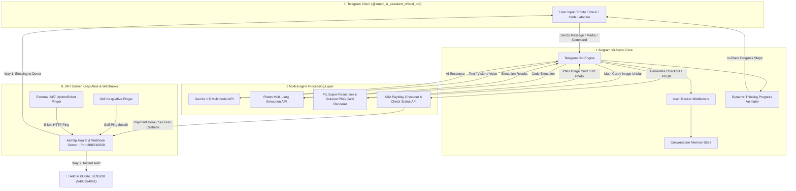

<div align="center">

<!-- 3D Animated Glowing Header Banner -->


<br>

<p align="center">
  <a href="https://github.com/Kosalsensok/telegram-python-bot">
    
  </a>
</p>

<p align="center">
  
  <a href="https://t.me/smart_ai_assistant_official_bot">
    
  </a>
  
  
</p>

<p align="center">
  <a href="https://www.python.org/"></a>
  <a href="https://docs.aiogram.dev/"></a>
  <a href="https://ai.google.dev/"></a>
  <a href="https://render.com/"></a>
  <a href="https://uptimerobot.com/"></a>
  
</p>

<!-- 3D Glowing Animated Divider -->


</div>

<br>

## 🌐 Multilingual Executive Summary / សេចក្តីសង្ខេបភាសា

<table align="center" width="100%">
<tr>
<td width="50%" valign="top">
<h3>🇬🇧 English Overview</h3>
An ultra-modern, production-grade <b>24/7 Omnimodal Telegram AI Bot</b> powered by Gemini 1.5 Multimodal Engine & ABA PayWay Payment Gateway. 
<br><br>
<b>Key Capabilities:</b>
<ul>
  <li>🧠 Multi-turn Conversational AI & Long Memory</li>
  <li>📐 Math Exercise Solution Renderer (PNG Solution Cards)</li>
  <li>✨ AI Photo Unblur & Lanczos Super-Resolution HD</li>
  <li>💳 Integrated ABA PayWay Sandbox KHQR & Test Cards</li>
  <li>🔔 2-Way Instant Telegram Alerts to Owner (KOSAL SENSOK)</li>
  <li>💻 Sandboxed Multi-Language Code Runner (Piston)</li>
</ul>
</td>
<td width="50%" valign="top">
<h3>🇰🇭 ភាសាខ្មែរ (Khmer Overview)</h3>
ជំនួយការ <b>AI Bot ឆ្លាតវៃដំណើរការ 24/7 លើ Telegram</b> ជាមួយបច្ចេកវិទ្យាចុងក្រោយ Gemini 1.5 និង ABA PayWay Sandbox Payment Gateway។
<br><br>
<b>សមត្ថភាពពិសេសចម្បងៗ៖</b>
<ul>
  <li>🧠 ឆ្លើយសំណួរទូទៅ, ដោះស្រាយលំហាត់ស្មុគស្មាញ</li>
  <li>📐 បង្កើតជារូបភាព PNG Card ចម្លើយច្បាស់ត្រជាក់ភ្នែក</li>
  <li>✨ កែរូបភាពមិនច្បាស់ឲ្យច្បាស់ត្រជាក់ភ្នែក (AI Unblur HD)</li>
  <li>💳 ប្រព័ន្ធទូទាត់ ABA KHQR & Test Credit Cards</li>
  <li>🔔 បាញ់សារ Alert ជូនដំណឹងត្រង់ចូល Telegram (<b>KOSAL SENSOK - ID: 5496354981</b>)</li>
  <li>💻 រត់ និង ពិនិត្យកូដ C++, Python, Java, JS ភ្លាមៗ 24/7</li>
</ul>
</td>
</tr>
</table>

<!-- 3D Waving Section Divider -->
<div align="center">
  
</div>

<br>

## 💳 3D ABA PayWay Gateway & 2-Way Alert Flow (ប្រព័ន្ធទូទាត់ ABA PayWay)

<div align="center">
  
</div>

```text
               ┌────────────────────────────────────────────────────────┐
               │  ពេល ABA បញ្ជាក់ថាបង់ $0.50 រួចរាល់ (Payment Approved)  │
               └───────────────────┬────────────────────────────────────┘
                                   │
         ┌─────────────────────────┴─────────────────────────┐
         ▼                                                   ▼
【 ផ្លូវទី ១ ៖ ផ្ញើទៅកាន់ User អ្នកបរិច្ចាគ 】               【 ផ្លូវទី ២ ៖ ផ្ញើទៅ Admin ផ្ទាល់ខ្លួន 】
• ផ្ញើចូល Private Chat របស់ User នោះ                        • ផ្ញើចូល Private Chat របស់ KOSAL SENSOK
• ខ្លឹមសារ៖ សារអរគុណ + សារជូនពរ                             (ID: 5496354981 / @kosalsensokpk)
                                                           • ខ្លឹមសារ៖ Alert ឈ្មោះ, Username, ID,
                                                             ចំនួនទឹកប្រាក់, Tran ID & ម៉ោងទូទាត់
```

<details>
<summary>🔒 <b>Click to View Protected Credentials Configuration (ចុចទីនេះដើម្បីមើល/បិទព័ត៌មាន API Keys)</b></summary>

<br>

> [!NOTE]
> All sensitive API Tokens & Secret Keys are strictly secured and stored using Environment Variables (`.env`). Below is the masked reference structure:

```env
# 🔒 Masked Credentials Reference
BOT_TOKEN=894604••••:••••••••••••••••••••••••••••••••
GEMINI_API_KEY=AIzaSy••••••••••••••••••••••••••••••••
ABA_MERCHANT_ID=ec47••••
ABA_API_KEY=758d62f9••••••••••••••••••••••••••••••••
ADMIN_USER_IDS=5496354981
SERVER_URL=https://telegram-python-bot-yt64.onrender.com
```

- **Official Visa Test Card:** `4286 0900 0000 0206` | Exp: `04/30` | CVV: `777`
- **Official Mastercard Test Card:** `5156 8399 3770 6777` | Exp: `01/30` | CVV: `993`
- **Admin Alert Telegram ID:** `5496354981`

</details>

<br>

<!-- 3D Glowing Animated Divider -->
<div align="center">
  
</div>

<br>

## 🎬 3D Live Telegram Execution Workflow (វីដេអូចលនាដំណើរការ)

```text
[ Telegram User ]  ───►  📷 Photo of Math Problem Uploaded
                               │
                               ▼
                   🔄 [ 1/4 ] វិភាគប្រធានលំហាត់ និង រូបភាព...
                               │
                               ▼
                   🧠 [ 2/4 ] គណនាតាមរូបមន្ត និង ទ្រឹស្តីបទ...
                               │
                               ▼
                   🖼️ [ 3/4 ] រៀបចំ និង បង្កើតរូបភាព PNG Solution Card...
                               │
                               ▼
                   ✨ [ 4/4 ] រួចរាល់! កំពុងផ្ញើចម្លើយ...
                               │
                               ▼
[ Reply Sent ]     ───►  🖼️ High-Res PNG Solution Card (imsela.com layout)
                         💬 Step-by-Step Clear Khmer Text Explanation
```

<br>

## 🏗️ 3D Interactive System Architecture (ស្ថាបត្យកម្មប្រព័ន្ធ)


```mermaid
flowchart TD
    subgraph Client ["📱 Telegram Client (@smart_ai_assistant_official_bot)"]
        U[User Input / Photo / Voice / Code / /donate]
    end

    subgraph BotCore ["⚡ Aiogram v3 Async Core"]
        TG[Telegram Bot Engine]
        MW[User Tracker Middleware]
        MEM[Conversation Memory Store]
        ANIM[Dynamic Thinking Progress Animator]
    end

    subgraph ServiceLayer ["🧠 Multi-Engine Processing Layer"]
        GEM[Gemini 1.5 Multimodal API]
        PST[Piston Multi-Lang Execution API]
        PIL[PIL Super-Resolution & Solution PNG Card Renderer]
        ABA[ABA PayWay Checkout & Check Status API]
    end

    subgraph ServerInfra ["🌐 24/7 Server Keep-Alive & Webhooks"]
        HS[Aiohttp Health & Webhook Server - Port 8080/10000]
        KP[Self-Keep-Alive Pinger]
        UR[External 24/7 UptimeRobot Pinger]
    end

    U -->|Sends Message / Media / Command| TG
    TG --> MW --> MEM
    TG --> ANIM
    ANIM -->|In-Place Progress Steps| U
    TG -->|Text / Vision / Voice| GEM
    TG -->|Code Execution| PST
    TG -->|Math Card / Image Unblur| PIL
    TG -->|Generates Checkout / KHQR| ABA
    GEM -->|AI Response| TG
    PST -->|Execution Results| TG
    PIL -->|PNG Image Card / HD Photo| TG
    ABA -->|Payment Hook / Success Callback| HS
    HS -->|Way 1: Blessing to Donor| U
    HS -->|Way 2: Instant Alert| ADMIN["🔔 Admin KOSAL SENSOK (5496354981)"]

    KP -->|Self-Ping /health| HS
    UR -->|5-Min HTTP Ping| HS
```

<br>

<!-- 3D Waving Section Divider -->
<div align="center">
  
</div>

<br>

## ✨ Features & Capabilities Matrix (លក្ខណៈពិសេសចម្បងៗ)

| Category | Feature | Description & Capabilities |
| :--- | :--- | :--- |
| **🧠 AI Engine** | **Omnimodal Chat** | Multi-turn conversational intelligence using Gemini 1.5 Flash with persistent memory. |
| **💳 Payments** | **ABA PayWay Gateway** | ABA KHQR & Test Credit Cards payment gateway with 2-way instant Telegram alert system. |
| **🖼️ Solution Cards** | **PNG Solution Card Renderer** | Generates crisp, high-resolution PNG solution cards for math exercise photos with clear Khmer typography (`Battambang` fonts) and highlighted answer containers. |
| **✨ Image Enhancer** | **AI Unblur & Super-Resolution** | `/enhance`, `/unblur`, `/hd` commands using Lanczos super-resolution, Unsharp Masking, and contrast tuning. |
| **🎨 Image Gen** | **AI Image Generation & Ratios** | Instant image creation with interactive ratio switching (`1:1`, `16:9`, `9:16`, `4:3`, `3:4`) and JPG/PNG downloads. |
| **💻 Execution** | **Piston Code Compiler** | Direct sandboxed execution of C++, Python, Java, JavaScript, and SQL code with clean Telegram HTML syntax highlighting. |
| **🎙️ Audio & PDF** | **Voice & Document OCR** | Speech-to-text audio transcription and Khmer PDF document text analysis. |
| **🎬 Animation** | **In-Place Animated Steps** | Dynamic progress animation context manager updating progress steps live in Telegram messages. |
| **⚡ Memory & Uptime** | **24/7 Keep-Alive System** | Automatic LRU cache cleanup, max 1920px image scaling, self-pinging keep-alive worker, and UptimeRobot monitoring. |

<br>

## 📱 Telegram UI/UX Showcase & Response Examples

<details>
<summary><b>📸 Click to Expand Interactive Telegram Response Examples</b></summary>

<br>

### 1. 📐 Math Exercise PNG Solution Card Output
```text
+-------------------------------------------------------------+
| 🤖 AI : imsela.com                                          |
|-------------------------------------------------------------|
| 1.                                                          |
| គេមាន:                                                       |
| MA = MD (បានន័យថា M ស្ថិតនៅលើអ័ក្សសម្មេទ្រីនៃអង្កត់ AD)       |
| AB = DB (បានន័យថា B ស្ថិតនៅលើអ័ក្សសម្មេទ្រីនៃអង្កត់ AD)       |
| ដូចនេះ ខ្សែបន្ទាត់ MB គឺជាអ័ក្សសម្មេទ្រីនៃអង្កត់ AD ។            |
| ----------------------------------------------------------- |
| [ ដូចនេះ ΔABC ≅ ΔDBC (លក្ខខណ្ឌ ជ-ជ-ជ) ]                       |
| ----------------------------------------------------------- |
| 🎓 លំហាត់រួចរាល់ !                                          |
+-------------------------------------------------------------+
Caption: 🎓 លំហាត់រួចរាល់ !
```

### 2. 💰 ABA PayWay Admin Notification Alert
```text
🔔 ALERT: មានការបរិច្ចាគថ្មីទទួលបាន! 💰
━━━━━━━━━━━━━━━━━━
👤 អ្នកបរិច្ចាគ: KOSAL SENSOK (@kosalsensokpk)
🆔 Telegram User ID របស់គេ: 5496354981
💵 ចំនួនទឹកប្រាក់: $0.50
🧾 Tran ID: D54981184972001
⏰ ម៉ោង: 2026-07-25 18:15:00

✅ ប្រព័ន្ធបានផ្ញើសារជូនពរទៅកាន់ ID របស់គាត់រួចរាល់ហើយ!
```

### 3. 💻 Clean C++ Code Execution Formatting
```cpp
#include <iostream>

int main() {
    for (int i = 1; i <= 5; ++i) {
        std::cout << "For Loop Demonstration: " << i << std::endl;
    }
    return 0;
}
```

</details>

<br>

## ⚡ Command Cheat Sheet (បញ្ជីពាក្យបញ្ជា)

```bash
/start       - 🚀 ផ្ដើមដំណើរការ Bot និង បង្ហាញម៉ឺនុយមេ (Start & Main Menu)
/donate      - 💖 បរិច្ចាគ $0.50 តាម ABA PayWay (ABA PayWay Donation)
/myid        - 🆔 បង្ហាញលេខ Telegram User ID ផ្ទាល់ខ្លួន (View Telegram ID)
/help        - ❓ បង្ហាញការណែនាំពីរបៀបប្រើប្រាស់ (Usage Instructions)
/mode        - 🔄 ជ្រើសរើសរបៀបដំណើរការ Bot (Change Operating Mode)
/enhance     - ✨ កែរូបភាពមិនច្បាស់ឲ្យច្បាស់ HD (Unblur & Enhance Photo)
/unblur      - 🖼️ ធ្វើឲ្យរូបភាពច្បាស់ត្រជាក់ភ្នែក (Super-Resolution Unblur)
/hd          - 📸 បម្លែងរូបភាពទៅជា HD Ultra-Clear (High Definition Upgrade)
/gen <prompt>- 🎨 បង្កើតរូបភាពតាមចំណង់ចំណូលចិត្ត (Generate AI Image)
/settings    - ⚙️ កំណត់ការកំណត់ផ្ទាល់ខ្លួន (User Preferences)
/clear       - 🧹 លុបប្រវត្តិសន្ទនា (Clear Conversation Memory)
/info        - ℹ️ មើលព័ត៌មានអំពី Bot (Bot & Profile Information)
/status      - 📊 ពិនិត្យស្ថានភាព Server និង Uptime (Check Health & Memory Status)
```

<br>

## 🔑 Environment Variables Reference (ការកំណត់បរិស្ថាន)

| Variable | Required | Description | Value Format |
| :--- | :---: | :--- | :--- |
| `BOT_TOKEN` | Yes | Telegram Bot API Token from @BotFather | `YOUR_BOT_TOKEN` |
| `GEMINI_API_KEY` | Yes | Google Gemini AI Key from AI Studio | `YOUR_GEMINI_API_KEY` |
| `ABA_MERCHANT_ID` | Yes | ABA PayWay Sandbox Merchant ID | `YOUR_ABA_MERCHANT_ID` |
| `ABA_API_KEY` | Yes | ABA PayWay Sandbox Public Key | `YOUR_ABA_PUBLIC_KEY` |
| `ADMIN_USER_IDS` | Yes | Telegram Owner ID for Instant Alerts | `5496354981` |
| `SERVER_URL` | Yes | Render Public External URL | `https://telegram-python-bot-yt64.onrender.com` |
| `PORT` | No | HTTP Health & Webhook Server Port | `8080` / `10000` |

<br>

## 🛠️ Local Installation & Development (ការដំឡើងលើម៉ាស៊ីន)

```bash
git clone https://github.com/Kosalsensok/telegram-python-bot.git
cd telegram-python-bot
python -m venv venv

# Windows:
venv\Scripts\activate

# Linux / Mac:
source venv/bin/activate

pip install -r requirements.txt
python main.py
```

<br>

## 🚀 24/7 Render Deployment Guide (ការដំឡើង Render 24/7)

1. Create a **New Web Service** on [Render Console](https://dashboard.render.com/).
2. Select your repository `Kosalsensok/telegram-python-bot`.
3. Set Build Command: `pip install -r requirements.txt`
4. Set Start Command: `python main.py`
5. Add Environment Variables (`BOT_TOKEN`, `GEMINI_API_KEY`, `ABA_MERCHANT_ID`, `ABA_API_KEY`, `ADMIN_USER_IDS`, `SERVER_URL`).
6. Set up a **5-minute HTTP Monitor** on [UptimeRobot](https://uptimerobot.com/) targeting `https://<your-app>.onrender.com/health`.

<br>

<!-- 3D Footer Animation Banner -->
<div align="center">
  

  <h3>👨‍💻 Created & Maintained by <b>Kosal Sensok</b></h3>

  <p align="center">
    <a href="https://github.com/Kosalsensok">
      
    </a>
  </p>

  <i>Star ⭐ this repository if you find it helpful!</i>
</div>